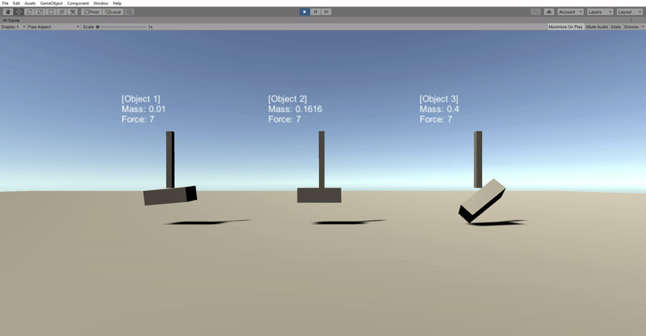

# Emulating Suction in Unity
*Tested in Unity 2020.1.0a23*

## Scene description and usage

This scene demonstrates unrealistic suction when applying forces between two objects in Unity.

The scene features 3 `DemoVariant` prefabs describing their mass with 2 main child `GameObject`s:
- a small item with a specific mass (cuboid)
- a suction tube applying a specific force at it's tip

The difference between the 3 prefabs is their mass alone.

The `SuctionTube` casts a ray out from its tip. A force is applied using [`Rigidbody.AddForceAtPosition`](https://docs.unity3d.com/ScriptReference/Rigidbody.AddForceAtPosition.html) at the point in the world where the raycast intersects with the collider of the rigidbody in front of it (the small item).

The `MoveSuctionTubes` object has fixed joints attached to each `SuctionTube`. This allows us to move the `MoveSuctionTubes` while observing realistic physics interactions at the tip of the `SuctionTube`. On playing the scene, a script translates the `MoveSuctionTubes` object along each axis at constant speeds:  

  

We can now observe the following behaviour with a force of `7`:
1. `Object 1`, with a mass of `0.01`, launches the object in an unexpected manner after losing full contact.
2. `Object 2`, with a mass of `0.1616`, behaves as we would expect from an object on a suction cup.
3. `Object 3`, with a mass of `0.4`, the object cannot be picked up and is dropped.

Our goal is to emulate suction accurately across a range of objects of varying masses without tailoring the force for each object.

Our issue lies with the first and third objects. The first object should never fly off after losing full contact and no matter the force should remain in full contact due to its small mass. The third object should not raise as the object has too large of a mass.

Physic Materials were applied to emulate a rubber suction cup and wooden block.

