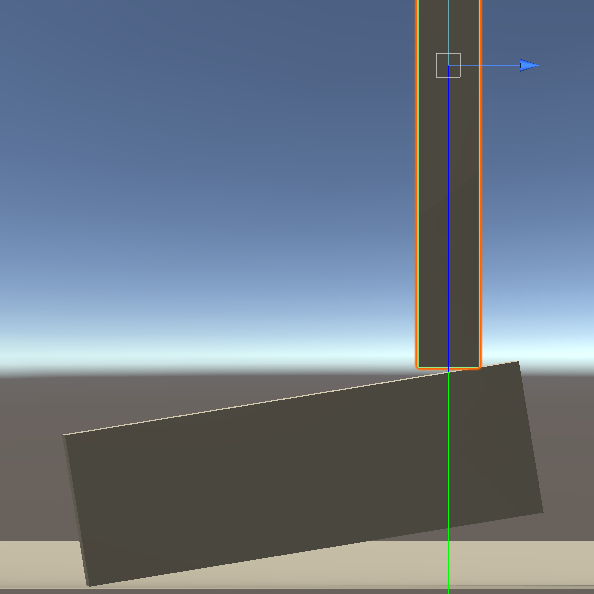
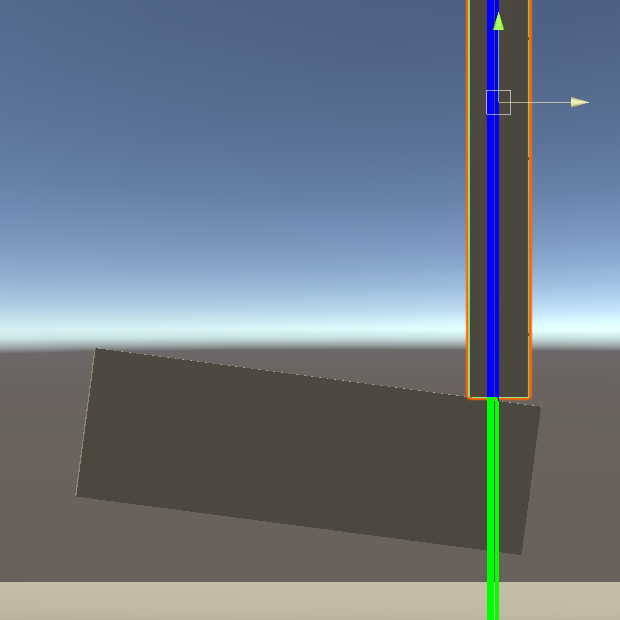

# Unrealistic forces in Unity
*Tested in Unity 2020.1.0a23*

## Scene description and usage

This scene demonstrates unrealistic physics when applying forces to rigidbodies.

The scene comprises of 2 key `GameObject`s:
- a small item (cuboid)
- a magnet (this is not intended to be an acurate model of a magnet but is sufficient to demonstrate this issue)

The magnet casts a ray out from its tip. A force is applied using [`Rigidbody.AddForceAtPosition`](https://docs.unity3d.com/ScriptReference/Rigidbody.AddForceAtPosition.html) at the point in the world where the raycast intersects with the collider of the rigidbody in front of it (the small item).

Run the scene and manually translate the magnet along the z axis (sliding the magnet across the item).

On manually translating the magnet, we observe the following behaviour:

1. A weak force (2 units) acting on a 0.1616kg mass (small item) produces reasonable behaviour, with the item pivoting downward under the influence of gravity as the magnet is translated to either edge:

2. However, on applying a larger force (5 units), the item will unintuitively begin to pivot upward as the gripper approaches the edge:


We suspect this is a result of inaccruate force/torque calculations within Unity.

No Physic Materials were applied, thus eliminating friction between item and magnet, which facilitates the observation of the issue.

**NB:** making the following changes to `DynamicsManager.asset` results in similar behaviour:
```
m_DefaultMaxDepenetrationVelocity: 10
m_DefaultSolverIterations: 25
m_DefaultSolverVelocityIterations: 25
m_SolverType: 1
```


