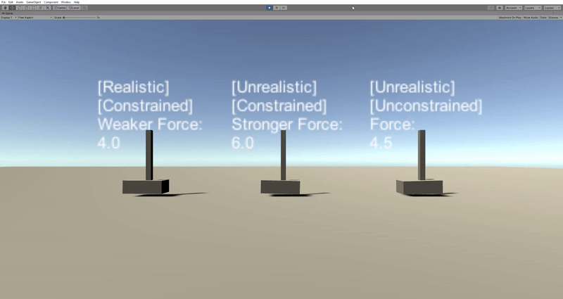

# Unrealistic forces in Unity
*Tested in Unity 2020.1.0a23*

## Scene description and usage

This scene demonstrates unrealistic physics when applying forces to rigidbodies in Unity.

The scene features a `Demo` prefab with 2 main child `GameObject`s:
- a small item (cuboid)
- a magnet (this is not intended to be an acurate model of a magnet but is sufficient to demonstrate this issue)

**NB: In some instances, rigidbody constraints have been applied to select position and rotation axes to prevent unintended movement (to be explained later).**

There are 3 instances of the `Demo` prefab:
- `Weaker Force`: Applies a force strength of 4.0 units, with select axis constraints.
- `Stronger Force`: Applies a force strength of 6.0 units, with select axis constraints.
- `(Unconstrained)`: Applies a force strength of 4.5 units, *without* axis constraints.

The magnet casts a ray out from its tip. A force is applied using [`Rigidbody.AddForceAtPosition`](https://docs.unity3d.com/ScriptReference/Rigidbody.AddForceAtPosition.html) at the point in the world where the raycast intersects with the collider of the rigidbody in front of it (the small item).

On running the scene, a script translates the magnet along a single axis, sliding the it across the surface of the item:  

  
  
We can now observe the following behaviour:
1. A `Weaker Force` acting on a 0.1616kg mass (small item) produces reasonable behaviour, with the item pivoting downward under the influence of gravity as the magnet is translated to either edge.
2. However, on applying a `Stronger Force`, the item will unintuitively begin to pivot upward as the magnet approaches the edge of the smaller item.
3. When no axis constraits are set (`[Unconstrained]`), the applied force rotates the small object along the other axes thus displacing the object from the desired position. This should not happen since the magnet is centered in the frame and is only being translated along a single axis.

We suspect that these issues are a result of inaccruate force/torque calculations within Unity.

No Physic Materials were applied, thus eliminating friction between item and magnet, which facilitates the observation of the issue.

**NB:** making the following changes to `DynamicsManager.asset` results in similar behaviour:
```
m_DefaultMaxDepenetrationVelocity: 10
m_DefaultSolverIterations: 25
m_DefaultSolverVelocityIterations: 25
m_SolverType: 1
```


